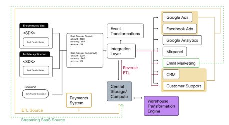

# 🚀 Building Data Infrastructure for a Fintech  

## 🏗 About the Project  
 To build an end-to-end data infrastructure, including a unified data layer and warehouse, that seamlessly integrates and optimizes existing tools and data sources. The goal is to enable real-time, actionable insights through analytics dashboards while enhancing customer profiles for better decision-making and personalization



## ✍️ Project Description


The data architecture captures event data from multiple sources (Firestore, Firebase analytics, Branch, Segment, Mixpanel, Google Ads), it is a mix of No-SQL database, and event data, flowing directly into BigQuery and can be pulled into destinations via Segment’s reverse ETL pipeline. The data is then processed and sent to various destinations, including Mixpanel, Branch, Ad Networks
## 🛠️ Installation & Execution

### **Requirements**
- **Python 3.x** must be installed.
- **Dependencies**:
  ```sh
  pip install  dbt-bigquery google-api-core google-auth google-cloud-bigquery google-cloud-storage google-cloud-core
  ```
